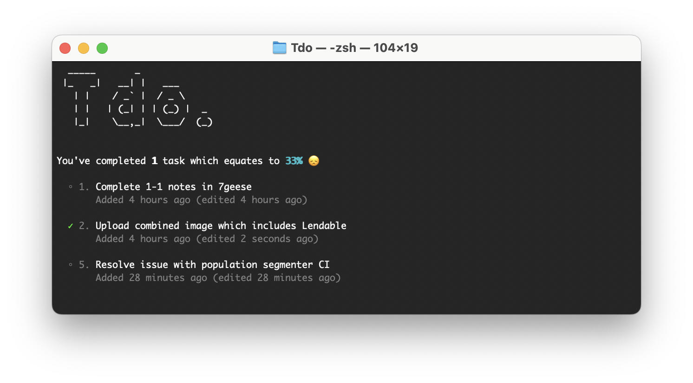

# Tdo

> Terminal based todo app for managing today's tasks with gentle reminders.




## Commands

We will first add three tasks &ndash; two for today and one for tomorrow:

```console
foo@bar:~$ tdo add "Athos"
foo@bar:~$ tdo add "Porthos"
foo@bar:~$ tdo add "Aramis" --for tomorrow
```

Using the `ls` command we will see that `Athos` and `Porthos` both need doing today:

```console
foo@bar:~$ tdo ls
```

However as `Aramis` was added as tomorrow's task, we won't see it until our system clock changes to tomorrow &ndash; unless we use the `ls upcoming` command to see every task after today:

```console
foo@bar:~$ tdo ls upcoming
```

We've just realised that we don't need the `Porthos` task any more, so we can go ahead and `remove` that (we can use the `ls` command to find its unique ID but assuming it's a fresh copy it will be `2`):

```console
foo@bar:~$ tdo rm 2
```

We've also realised we prefer the fourth Muskateer so we'll replace `Athos` with `D'Artagnan`:

```console
foo@bar:~$ tdo edit 1 "D'Artagnan"
```

And as we're exceptional at what we do, we'll mark `D'Artagnan` as completed which we can later validate with the aforementioned `ls` command (in the unlikely event we've made a mistake we can revert that with the `mark <id> incomplete` command):

```console
foo@bar:~$ tdo mark 1 complete
```

Sometimes it's nice to be randomly assigned a task so you don't always pick the most favourable ones &ndash; for this use the `task` command a randomly picked task will be assigned to you.

```console
foo@bar:~$ tdo task
```
